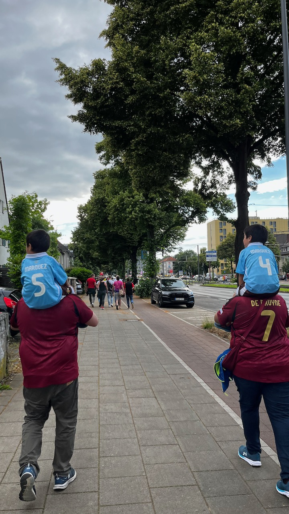
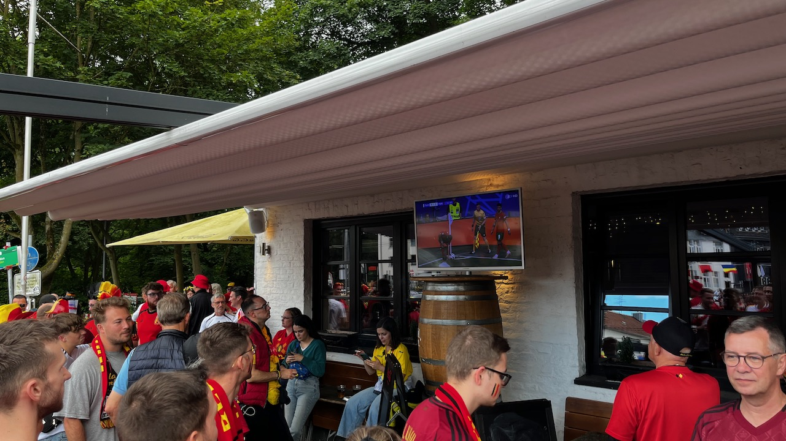
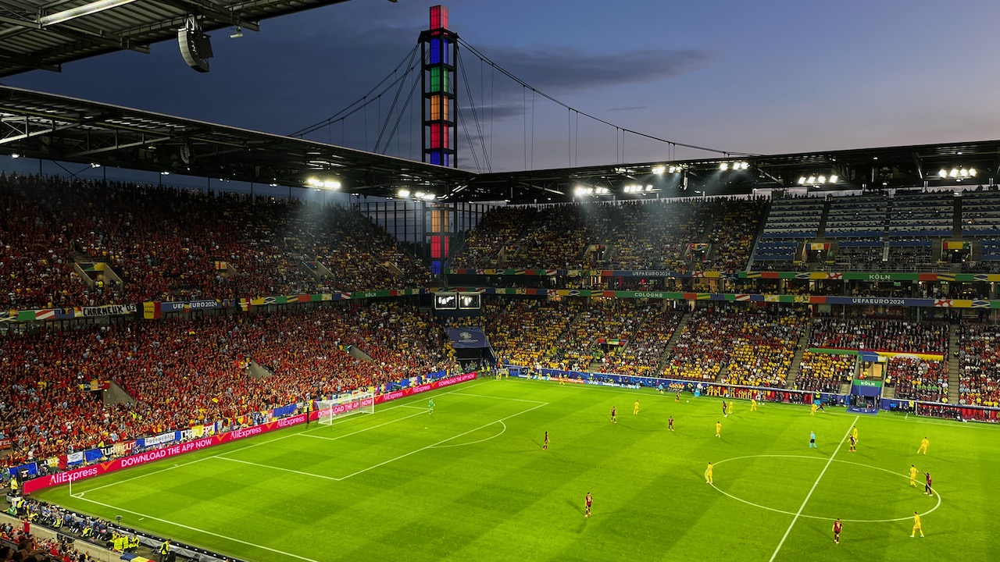
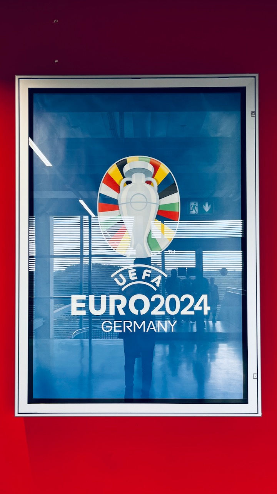
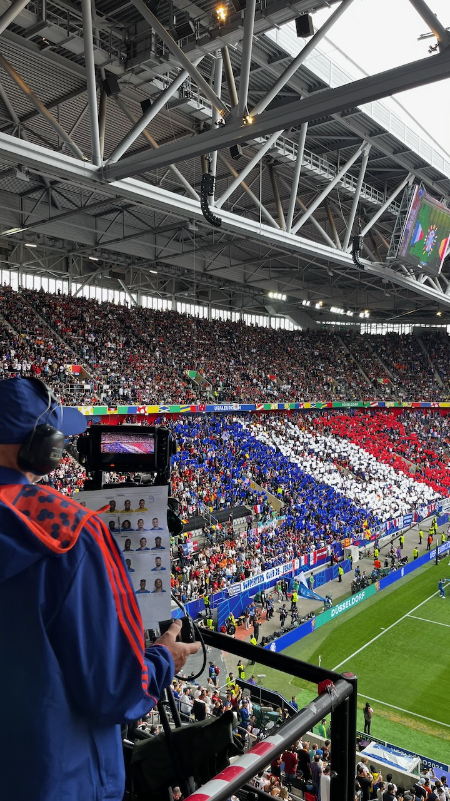
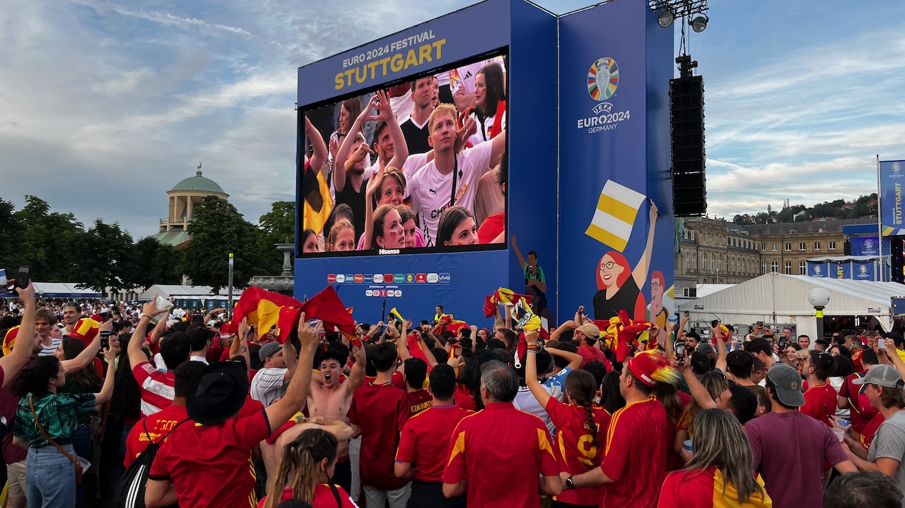

## EURO 2024 - Tagebuch

### 13.06.2024

Morgen geht's los. Fünf Städte sollen es sein in den kommenden elf Tagen. Die Bahn ist für eine Rundreise keine Option, mit dem Auto ist es verlässlicher. Erste Zwischenbilanz nach 2 Stunden Fahrt: 1 1/2 Stunden Stau. Läuft.

### 14.06.2024 - Zeit, dass sich was dreht.

Wie geht man denn jetzt ran an so eine Heim-EM? London liegt grade zwei Wochen zurück. Das ist noch nicht genug Zeit, die Spielzeit in Gänze verarbeitet zu haben. 
Und zugegeben: Ich hätte alle Tickets & ein erfolgreiches Abschneiden der deutschen Mannschaft ohne Zögern für eine erfolgreiche zweite Halbzeit im Wembley geopfert.  

Hätte, hätte.. Jetzt geht es um was anderes. Und spätestens nach dem Zelt-Aufschlagen steigt dann auch die Vorfreude auf den Abend. Das liegt insbesondere an den fantastischen Gästen aus Schottland, die sich in großen Massen auch ohne Tickets auf den Weg gemacht haben, die Stadt in blau zu färben.

No Scotland, no party.

Die Orga rund ums Spiel ist leider eine Vollkatastrophe. Zwischen Aufbrechen am Odeonsplatz & Am-Platz-Ankommen liegen geschlagene drei Stunden (!), was auch an einem künstlich angelegten Nadelöhr von nur zwei geschaffenen Eingängen liegt.

Damit verbleiben grade mal 30 Minuten Zeit zum Klarkommen, bevor das Turnier angepfiffen wird. 

Das torreiche Spiel ist das Eine. 
Noch mehr dominiert an diesem Abend aber das Gefühl wie ein sechsjähriges Kind das weiß, dass es über eine lange Zeit im Süßigkeitenladen eingeschlossen ist. 
Vier Wochen fast jeden Tag Fußball, wunderbar. 

Abgerundet wird der Abend mit Musik & Lagerfeuer am Campingplatz. Fünf Gegentore? Kein Grund, enttäuscht zu sein. Was für wunderbare Menschen.

    

        
    

    

        
        
        
    

### 15.06.2024 

Regen in München. Kein Grund, nicht wahlweise in Lederhose oder Schottenrock durch die Stadt zu ziehen. 
Schnittmenge: Die Gerstenkaltschale.

### 15.06.2024

What the f***? Spanien ballert Kroatien mit 3:0 bereits zur Pause weg. Das war brettstark. Alle reden über England und Frankreich, aber wieso zum Teufel war Spanien bisher nicht auf dem Zettel?

### 16.06.2024

Umzug ins Hotel, das zwei Tage nach dem Auftaktspiel jetzt wieder erschwinglich ist. 
Auf der Suche nach Polen-Niederlande im TV die Erkenntnis, mir für eine Sache noch keine Taktik zurechtgelegt zu haben: Es gibt gar nicht alle Spiele im Free-TV. 

Auswege: VPN & Streaming. Oder: Sportschau Radio. Fühlt sich an wie früher bei der WDR2-Konferenz.

### 19.06.2024 Deutschland - Ungarn

TODO 1

Spannende Beobachtung: Im Umfeld dieses Spiels sind wieder viele Schotten unterwegs, auch im Stadion. 

### 21.06.2024 Slowakei - Ukraine

TODO 2

Die Düsseldorfer Altstadt ist ein Highlight in diesen Tagen. Mit der eigenen Spielstädte in der Stadt und Gelsenkirchen, Dortmund & Köln im 1h-Umkreis ist die Stadt quasi das Herz der EM. Das spiegelt sich auch in den vielen verschiedenen Trikots am Abend wieder.

### 22.06.2024 Belgien - Rumänien

Ein Tag, an dem einfach alles stimmt. Das Wetter, die Atmosphäre, die Stadt & das alles zusammen mit meinem Papa, der mich mit der Begeisterung für diesen Sport und das Drumherum überhaupt erst abgesteckt hat. Nach langer Zeit pilgern wir mal wieder über die Aachener Straße nach Müngersdorf. 

Bereits eine Stunde vor Anpfiff ist die Hölle los. ¾ des Stadions trägt gelb. Das kommt vor allem wegen des kurzen Anreisewegs der Belgier sehr unerwartet. 
Zu *Freed from Desire* drehen alle einmal gemeinsam durch. Die Rumänen sind laut (!) und dauerpräsent. Daran tut auch die frühe 1:0 Führung für die roten Teufel keinen Abbruch. Erst das 2:0 durch Kevin de Bruyne in der 80. Minute führt zu einem kleinen Dämpfer. 
Kurz vor Ende des Spiels dann schallt aber schon wieder ein euphorisch optimistisches *Romania* durch das Müngersdorf Stadion, in dem auch heute wieder zwischendrin Schotten gesichtet werden konnten.

Fußballkultur, genauso wie sie sein soll. 

    

        
    

    

        
        
        
    

### 23.06.2024 Deutschland - Schweiz

TODO 3

Schotten. 

### 26.06.2024

Spiel im Volkspark: Die Türkei schlägt Tschechien in der 90 + 4. Minute und zieht damit ins Achtelfinale ein. Hupkonzert bis in die Nacht. 

### 29.06.2024

Deutschland schlägt Dänemark. Verdient, aber mit Mühe. 

Bitterer Abend für Joachim Andersen: Erst wird das Tor zurückgepfiffen, was früher ohne weiteren Kommentar unter *gleiche Höhe* durchgegangen wäre. Dann ist es sein (fragwürdiges) Handspiel, was zum Elfmeter und der deutschen Führung führt. 

### 01.07.2024 Frankreich - Belgien

Die Bahn regelt. Geplante Ankunft in Düsseldorf: 09:20. Tatsächlich angekommen: 12:10. Bei 2h Verspätung gibt es 50% des Ticketpreises zurück: 6€, ein Getränk im Stadion. Yummi.

Das Spiel selbst gibt leider nicht so viel her. Ein gegenseitiger Abnutzungskampf wird in der 85. Minute durch ein abgefälschtes Tor zugunsten Frankreichs entschieden.

In der Altstadt gibt es anschließend das Abendspiel zwischen Portugal & Slowenien zu sehen. Ein torloses Unentschieden nach 120 Minuten, man merkt, dass die Leichtigkeit der Vorrunde jetzt ein wenig dem K.O.-Modus weicht. Der Stimmung tut das keinen Abbruch, die Atmosphäre ist fast besser als im Stadion. 
Natürlich steigt auch der Schottland-Zähler auf Sechs.

    
    

### 02.07.2024

1x Deutschland - Spanien für scheißteuer im Warenkorb. Ist nicht für mich gedacht, aber den Trip lasse ich mir trotzdem nicht entgehen.

### 05.07.2024

Sommer, Sonne, Heim-EM & Viertelfinale, geil. In Stuttgart liegt eine besondere Atmosphäre in der Luft, in der Innenstadt ist die Vorfreude schon am Mittag greifbar.

Papa & ich schlendern einmal über das Fanfest und machen uns dann schon auf gen Neckarstadion. 
Kleiner Insidertipp: Der Fitnesssalat im Sportrestaurant im Neckarpark. 

Mit Sepp Maier gibt es auch noch einen prominenten Gast & Europameisterschats-Vibes am Tisch. 
Ganz wegatmen lässt sich die Tatsache, dass da ein saustarker Gegner wartet, allerdings nicht. 

Dann müssen wir leider auseinander gehen, der Schlossplatz ist zwei Stunden vor Abpfiff schon rappelvoll. Nach Anpfiff folgen 120 Minuten richtig guter Fußball, Drama & Fingernägelkauen. 

In der 119. zerplatzen alle Europameisterschafts-Träume. Nachdem Niklas Füllkrug den letzten Kopfball neben das Tor setzt: Stille. 

Immerhin: Als Anhänger von Borussia Dortmund hat man in diesem Moment einen Vorsprung in der Übung darin mit gebrochenen Herzen umzugehen. 

Beim Reise-Vorbei-Abschluss-Bier kommt mit das Nick Hornby Zitat wieder in den Sinn:

*Ich verliebte mich in den Fußball, wie ich mich später in Frauen verlieben sollte: plötzlich, unerklärlich, unkritisch und ohne einen Gedanken an den Schmerz und die Zerrissenheit zu verschwenden, die damit verbunden sein würden.*

### 06.07.2024

Kurze Nacht und früher Wecker für die Rückfahrt nach Hamburg. 

Coole Begegnung im Zug mit Steve: Snapback-Cap, Nasenring, Sneaker. Hätte ich auf maximal 40 geschätzt, ist aber 65 (!).
Steckt mich sehr mit seiner Lebensfreude an. Und das, obwohl sich im Laufe des Gesprächs rausstellt, dass sein Vater in dieser Woche verstorben ist.  

In Frankfurt steigt ein JGA zu. 10 Uhr morgens, Steve holt zwei Bier aus dem Boardbistro (*Macht nur Spaß, wenn man mitmacht. Weiß ich aus meiner Zeit in Köln.*)

Frei nach Dragoslav Stepanović: *Lebbe geht weider.*

### 09.07.2024

Gefühlt ist das Turnier mit dem Ausscheiden der deutschen Mannschaft auch zu Ende gegangen. Sich nochmal aufzuraffen kostet richtig Energie, lohnt aber: In einem guten Halbfinale brennt es vor allem in den ersten 30 Minuten. Die Gnadenlosigkeit, mit der Lamine Yamal das 2:1 in den Winkel knallt lässt aber für den Moment wenig Zweifel an der Frage zu, wer nächsten Sonntag den Pokal in den Berliner Nachthimmel stemmt.

### 10.07.2024

Das Raum-Zeit Kontinuum ist gekrümmt: England spielt Fußball. In der 90.Minute verstummt die Oranje-Partystimmung in Dortmund. 
Das ist doppelt schade, da ESP - NIE wahrscheinlich das fußballerisch attraktivere Endspiel geworden wäre.
Außerdem endet die wilde Reise der Niederländer, die heute mit einer Mannschaftsstärke von 80.000 in Dortmund aufgeschlagen sind. 

Der Snollebollekes Song geht seit ein paar Tagen nicht mehr aus dem Kopf. 
Das Abgrasen nach Videos im Netz schafft dabei keine Abhilfe. 

Flashback in eine Zeit, in der verwackelte Videos aus Stadien noch digitales Gold waren. 18 Jahre und damit fast so alt wie Youtube selbst das horto magiko Video der Panathinaikos Fans, dass ich mir als 15-Jähriger bestimmt 200 Mal angeschaut habe. 
Der erste Kommentar trifft es genau:
*Every couple of years I come back and watch this and every fucking time it gives me goosebumps.*

Wer weiß, wie die Welt in 18 Jahren aussieht. 
Aber bis dahin werde ich mir noch oft Holland-Videos der Euro 2024 gucken, soviel ist sicher. 

### 13.07.2024

Fundstück aus dem Netz, auf die Melodie von Atomic Kitten's *Whole Again*: 

*Southgate you're the one, you still turn me on. //   
Footballs coming home again.*

Es würde alles ad absurdum führen und grade das macht es wieder so herrlich attraktiv.

